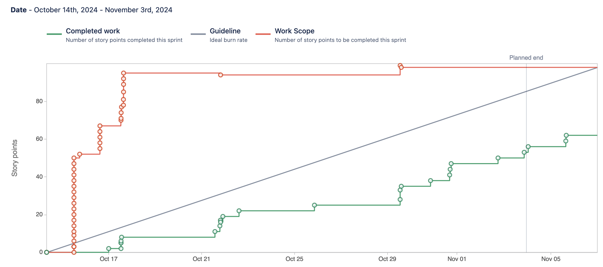
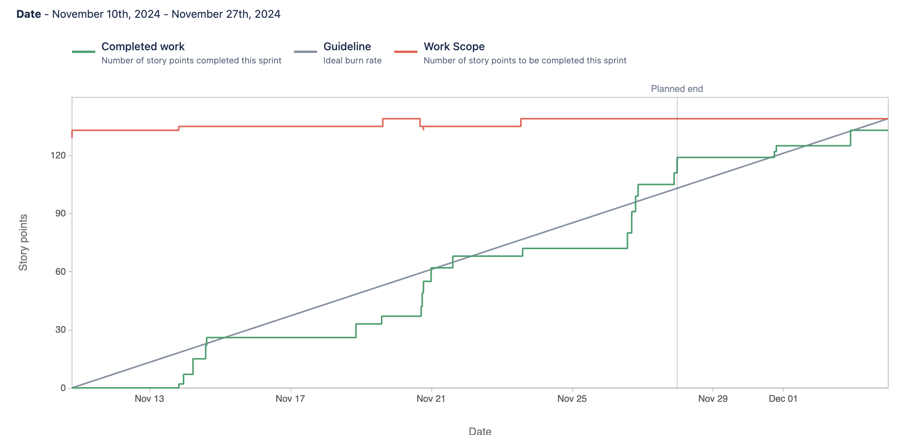

# FitLife: Healthy Life, Happy Life

> **FitLife is a comprehensive iOS app for gym tracking and nutrition management.**

## Table of Contents
- [Description](#description)
- [General Info](#general-info)
- [Technologies Used](#technologies-used)
- [Features](#features)

## Description

### Who We're Working With
Our team consists of:
- **[Jonas Tuttle](mailto:jonastuttle@txstate.edu)**
- **[Thomas Mendoza](mailto:tmendoza@txstate.edu)**
- **[Sam Arshad](mailto:jsb211@txstate.edu)**
- **[Luke Flannigan](mailto:nym15@txstate.edu)**
- **[Gabriel Ciaburri](mailto:aff38@txstate.edu)**

### What We're Creating
We are developing **FitLife: Healthy Life, Happy Life**, an iOS app designed to help users track their gym workouts and nutrition. FitLife aims to be an all-in-one fitness companion that simplifies achieving health and fitness goals by providing tools for logging exercises, tracking nutritional intake, setting goals, and monitoring progress.

### Who We're Doing It For
Our target audience includes fitness enthusiasts, gym-goers, and anyone interested in improving their health and wellness. FitLife is designed to support both beginners starting their fitness journey and experienced athletes aiming to optimize their regimen.

### Why We're Doing This
We believe that maintaining a healthy lifestyle should be accessible and straightforward. By creating FitLife, we hope to empower users to take control of their fitness journeys, make informed decisions, and achieve their personal health goals. Our mission is to have a positive impact on users' lives by promoting wellness and providing a supportive platform for their fitness endeavors.

## General Info

### What's Missing
We would benefit from:
- **User Feedback**: Early adopters willing to test the app and provide valuable feedback.
- **Additional Expertise**: Specialists in AI and machine learning for future feature integrations.
- **Funding**: Financial support to enhance development and expand functionalities.

## Technologies Used
- **[Swift](https://developer.apple.com/swift/)** - Programming language for iOS development.
- **[SwiftUI](https://developer.apple.com/xcode/swiftui/)** - A modern framework for building user interfaces across all Apple platforms.
- **[Xcode](https://developer.apple.com/xcode/)** - An integrated development environment (IDE) for macOS containing a suite of software development tools.
- **[Firebase](https://firebase.google.com/)** - A platform developed by Google for creating mobile and web applications, providing backend services like authentication and data storage.
- **[Firestore](https://firebase.google.com/products/firestore)** - A scalable NoSQL cloud database to store and sync data for client- and server-side development.
- **[Figma](https://www.figma.com/)** - A collaborative interface design tool used for creating UI designs and prototypes.
- **[Jira](https://www.atlassian.com/software/jira)** - A project management tool for tracking tasks, bugs, and sprints.
- **[Bitbucket](https://bitbucket.org/)** - A Git-based source code repository hosting service for collaboration.

## Features

### Initial Features for the First Sprint (MVP)

For our first two-week sprint, we aim to develop a Minimum Viable Product (MVP) that includes the following features:

#### 1. Account Creation and Login

- **Description**: Users can create an account and log in securely to store their data and access it across devices.
- **Who Uses It**: All users of the app.
- **Corresponding User Story**:  
  As a new user, I would like to create an account and log in so that my data is securely stored and accessible across devices.

#### 2. Workout Logging

- **Description**: Enables users to log their workouts by adding exercises with sets, reps, and weights, allowing them to track their fitness progress over time.
- **Who Uses It**: Users who want to track their workout routines and monitor their progress.
- **Corresponding User Story**:  
  As a user, I would like to log my workouts by adding exercises with sets and reps so that I can track my fitness progress over time.

#### 3. Nutrition Logging

- **Description**: Allows users to log their food intake by adding food items with nutritional data, helping them to track daily nutrition and calorie intake.
- **Who Uses It**: Users looking to monitor their nutritional intake and manage their diet.
- **Corresponding User Story**:  
  As a user, I would like to log my food intake by adding food items with nutritional data so that I can track my daily nutrition and calorie intake.

#### 4. View Daily Summaries

- **Description**: Provides users with daily summaries of their workouts and nutrition, including total calories consumed and burned, and visual representations of macro distributions.
- **Who Uses It**: Users who want to easily assess their daily fitness and dietary activities.
- **Corresponding User Story**:  
  As a user, I would like to view summaries of my daily workouts and nutrition so that I can easily assess my daily fitness and dietary activities.

#### 5. Basic Goal Setting

- **Description**: Allows users to set basic fitness goals, such as daily calorie intake and weekly workout frequency, and track their progress towards these goals.
- **Who Uses It**: Users aiming to achieve specific health objectives and stay motivated.
- **Corresponding User Story**:  
  As a user, I would like to set basic fitness goals (e.g., daily calorie intake, workout frequency) so that I have targets to motivate my fitness journey.

 

## Sprint 1

### Burnup Chart

### Contributions
**Thomas**: "Provided users with a UI and functionality in Swift to create and save custom workouts to their account"
- `Jira Task: 1. Design Workout Logging UI` 
    - [CTP-22](https://cs3398-borgs-f24.atlassian.net/browse/CTP-22?atlOrigin=eyJpIjoiMzVhNWE1MWUzNWJhNDBmZWFiMzdlOTVhYTkwMmJmYWIiLCJwIjoiaiJ9), [Bitbucket Link](https://bitbucket.org/cs3398-borgs-f24/fitlife-healthy-life-happy-life/branch/CTP-22-1.-design-workout-logging-ui)
- `Jira Task: 2. Create Exercise and Workout Data Models`
  - [CTP-23](https://cs3398-borgs-f24.atlassian.net/browse/CTP-23?atlOrigin=eyJpIjoiZjA2ZWMwZThiODQ1NDgxM2JmOGVjMGQwYTg2ZGI0MjkiLCJwIjoiaiJ9), [Bitbucket link](https://bitbucket.org/cs3398-borgs-f24/fitlife-healthy-life-happy-life/branch/CTP-23-2.-create-exercise-and-workout-da)
- `Jira Subtask: Create Xcode project in team bitbucket for everyone to edit`
  - [CTP-92](https://cs3398-borgs-f24.atlassian.net/browse/CTP-92?atlOrigin=eyJpIjoiYWYzMzNlYTA0YTNmNDRlYmExYWQ0YjlmZjJiODdjZGQiLCJwIjoiaiJ9), [Bitbucket Link](https://bitbucket.org/cs3398-borgs-f24/%7B87bd3ba6-e4f4-475c-89d4-674a7f216cd5%7D/branch/CTP-92-create-xcode-project-in-team-bitb)
- `Jira Task: 3. Implement Functionality to Add and Save Workouts`
  - [CTP-24](https://cs3398-borgs-f24.atlassian.net/browse/CTP-24?atlOrigin=eyJpIjoiOGRiNDgyMTkwZjBmNDhmZGFiYjRiMDcwZTdiMzJhYWMiLCJwIjoiaiJ9), [Bitbucket Link](https://bitbucket.org/cs3398-borgs-f24/%7B87bd3ba6-e4f4-475c-89d4-674a7f216cd5%7D/branch/feature/CTP-24-3.-implement-functionality-to-add)

**Luke**: "Designed and implemented key user interface components, including the nutrition view, opening screens, dashboard, and profile page, enhancing user navigation and interaction within the app."

- `Jira Task: Design Nutrition Logging UI`
  - [CTP-27](https://cs3398-borgs-f24.atlassian.net/browse/CTP-27), [Bitbucket Link](https://bitbucket.org/cs3398-borgs-f24/fitlife-healthy-life-happy-life/branch/CTP-27-1.-nutrition-ui)
- `Jira Task: Design Opening Screens`
  - [CTP-96](https://cs3398-borgs-f24.atlassian.net/browse/CTP-96), [Bitbucket Link](https://bitbucket.org/cs3398-borgs-f24/fitlife-healthy-life-happy-life/pull-requests/2/overview)
- `Jira Task: Implement Opening Screens`
  - [CTP-98](https://cs3398-borgs-f24.atlassian.net/browse/CTP-98), [Bitbucket Link](https://bitbucket.org/cs3398-borgs-f24/fitlife-healthy-life-happy-life/branch/CTP-98-implement-opening-screens)
- `Jira Task: Design Dashboard UI for Daily Summaries`
  - [CTP-32](https://cs3398-borgs-f24.atlassian.net/browse/CTP-32), [Bitbucket Link](https://bitbucket.org/cs3398-borgs-f24/fitlife-healthy-life-happy-life/branch/CTP-32-1.-design-dashboard-ui)
- `Jira Task: Implement Profile View Screen`
  - [CTP-36](https://cs3398-borgs-f24.atlassian.net/browse/CTP-36), [Bitbucket Link](https://bitbucket.org/cs3398-borgs-f24/fitlife-healthy-life-happy-life/branch/CTP-36-5.-implement-profile-view-screen)
- `Jira Task: Calculate and Display Total Daily Nutrition`
  - [CTP-30](https://cs3398-borgs-f24.atlassian.net/browse/CTP-30), [Bitbucket Link](https://bitbucket.org/cs3398-borgs-f24/fitlife-healthy-life-happy-life/branch/CTP-30-4.-calculate-and-display-nutrition)
  
  **Jonas**: "Implemented Firebase into app, added functionality for user authentication, and designed/set-up app splash view."

  - `Jira Task: 4 - Design App Folder Navigation)`
    - [CTP-40](https://cs3398-borgs-f24.atlassian.net/browse/CTP-40),
    [Bitbucket Link]https://bitbucket.org/cs3398-borgs-f24/fitlife-healthy-life-happy-life/branch/CTP-40-4.-design-app-folder-navigation)
  - `Jira Task: 2 - Set Up Firebase Authentication in Project`
    - [CTP-18](https://cs3398-borgs-f24.atlassian.net/browse/CTP-18),
    [Bitbucket Link](https://bitbucket.org/cs3398-borgs-f24/fitlife-healthy-life-happy-life/branch/CTP-18-2.-set-up-firebase-authentication)
  - `Jira Task: 3 - Implement SplashView Functionality`
    - [CTP-34](https://cs3398-borgs-f24.atlassian.net/browse/CTP-34),
    [Bitbucket Link](https://bitbucket.org/cs3398-borgs-f24/fitlife-healthy-life-happy-life/branch/CTP-34-3.-implement-splashview-functiona)
  - `Jira Task: 2 - Design SplashView`
    - [CTP-33](https://cs3398-borgs-f24.atlassian.net/browse/CTP-33),
    [Bitbucket Link](https://bitbucket.org/cs3398-borgs-f24/fitlife-healthy-life-happy-life/branch/CTP-33-2.-design-splashview)
  - `Jira Task: 1 - Implement Sign-in and Login functionality`
    - [CTP-17](https://cs3398-borgs-f24.atlassian.net/browse/CTP-17),
    [Bitbucket Link](https://bitbucket.org/cs3398-borgs-f24/fitlife-healthy-life-happy-life/branch/feature/CTP-17-1.-Authentication)
  
  **Gabriel**: "Implemented goal setting data models to keep track of all user data for progress over time, as well as the views associated with goals."

  - `Jira Task: 1. Design Goal Setting UI`
    - [CTP-37](https://cs3398-borgs-f24.atlassian.net/browse/CTP-37)
  - `Jira Task: 2. Implement Functionality to set User Basic Info`
    - [CTP-38](https://cs3398-borgs-f24.atlassian.net/browse/CTP-38)
  - `Jira Task: 3. Implement Progress Tracking on Dashboard`
      - [CTP-39](https://cs3398-borgs-f24.atlassian.net/browse/CTP-39)

 
<strong>Sam Arshad</strong>

-[Worked on the API Recipe Search Feature.](https://cs3398-borgs-f24.atlassian.net/browse/CTP-28?atlOrigin=eyJpIjoiNGZkY2E2N2JjODFlNDc4Y2FlZTI4MzJhNTE0YzdiMWEiLCJwIjoiaiJ9) 
  
  - [Bitbucket](https://bitbucket.org/cs3398-borgs-f24/fitlife-healthy-life-happy-life/src/CTP-28-2.-integrate-food-database-api/)
-[Worked on the Create User Feature.](https://cs3398-borgs-f24.atlassian.net/browse/CTP-19?atlOrigin=eyJpIjoiNTIyZTZkZDg1ZDk0NDIzZmFjMDc5YzlkMDFlNzQ0ZDUiLCJwIjoiaiJ9)
    -Realized that this was a redundant step as all user authentication would be done through Firebase. Provided J.Tuttle boilerplate code for Firebase Authentication.
   - [Bitbucket](https://bitbucket.org/cs3398-borgs-f24/fitlife-healthy-life-happy-life/src/CTP-19-3.-implement-sign-up-functionality/)
-[Worked on "logging" food entries code.](https://cs3398-borgs-f24.atlassian.net/browse/CTP-29?atlOrigin=eyJpIjoiNzQ3OTdkZjUzZTU4NGNjZmJiMjBhZmEyMTc0MzRlYTciLCJwIjoiaiJ9)
  - [Bitbucket](https://bitbucket.org/cs3398-borgs-f24/fitlife-healthy-life-happy-life/src/CTP-29-3.-implement-functionality-to-add-and-save-food-entries/)

<strong><u>Note:</u></strong> Recognizing my lack of proficiency in Swift, SwiftUI and Xcode, I proactively completed a course and earned a certificate in Swift, while working on these tassks I've been dedicated on improving my skills and have currently made progressive leaps in becoming better at these languages/technologies. 

---
### Next Steps
**Thomas**: 
- Implement workout API to have prexisting exercises to simplify input process
  - [Workout API](https://www.api-ninjas.com/api/exercises)
- Design reports UI
- Use user workout data to generate customized reports
- Implement daily AI-powered workout suggestions from user data
  - pull suggestions from goals and existing workouts

**Luke**:
- Integrate the Nutrition View UI with backend services to enable real-time tracking and input of user data.
- Implement functionality in the Profile section to allow users to update and customize their personal profiles.
- Connect the Progress section to backend services to display real-time user data and achievements.

**Jonas**:
- Design and implement general app/account settings, such as username/password changes, log out, account deletion, etc.
- Work with real-time analytics to track user app usage.
- Set up basic notification functionality; test various effective ways to work notifications into the app via location, daily progress, etc.
- Study and implement ways to test new features on the app.

**Gabriel**:
- Integrate goal tracking with workouts and calorie counter.
- Implement day-to-day, week-to-week, etc. goals on dashboard.
- Integrate SwiftData with Firebase authentication.

---

## Sprint 2

### Burnup chart

### Contributions

**Thomas**: "Refactored and implemented significant components for the Workout functionality to prepare for local user data input, focusing on the data model's flexibility to work with the newly created library of workouts, integration of exercise features by moving attributes to exercises that were previously tied to workout, and UI enhancements for ease of use on mobile."

- `Jira Task: Implement Difficulty Level Indicators`
- [SCRUM-55](https://cs3398-not-borgs-again-fall24.atlassian.net/browse/SCRUM-55?atlOrigin=eyJpIjoiMzYzZmUyZWM4M2NhNGZlYmJhZjQ2ZjA0NWE3OWQzZTkiLCJwIjoiaiJ9), [Bitbucket Link](https://bitbucket.org/cs3398-borgs-f24/%7B87bd3ba6-e4f4-475c-89d4-674a7f216cd5%7D/branch/SCRUM-55-4.-implement-difficulty-level-i)
- `Jira Task: Integrate Instructional Images or Videos`
- [SCRUM-54](https://cs3398-not-borgs-again-fall24.atlassian.net/browse/SCRUM-54?atlOrigin=eyJpIjoiZWJlYzU5MGMyNWRjNDk1MTgzNDBjOTQ3MmQ4YTY1NzAiLCJwIjoiaiJ9), [Bitbucket Link](https://bitbucket.org/cs3398-borgs-f24/%7B87bd3ba6-e4f4-475c-89d4-674a7f216cd5%7D/branch/SCRUM-54-3.-integrate-instructional-imag)
- `Jira Task: Implement workout view and workout data model with real user data`
- [SCRUM-43](https://cs3398-not-borgs-again-fall24.atlassian.net/browse/SCRUM-43?atlOrigin=eyJpIjoiNTE1ZDRhMTM3ZTI0NDA3NWE4ZjM3MmFmYjlmN2ExNmUiLCJwIjoiaiJ9), [Bitbucket Link](https://bitbucket.org/cs3398-borgs-f24/%7B87bd3ba6-e4f4-475c-89d4-674a7f216cd5%7D/branch/SCRUM-43-implement-workout-view-and-work)
- `Jira Task: Design Workout selection UI`
- [SCRUM-114](https://cs3398-not-borgs-again-fall24.atlassian.net/browse/SCRUM-114?atlOrigin=eyJpIjoiZDY2MTY0NzQ3NzRmNGM0NWEwZjQ3Njc3OWM1NTQ4OTciLCJwIjoiaiJ9), [Bitbucket Link](https://bitbucket.org/cs3398-borgs-f24/%7B87bd3ba6-e4f4-475c-89d4-674a7f216cd5%7D/branch/SCRUM-114-design-workout-selection-ui)

**Luke**: "Developed and integrated essential features for the app, including the design and implementation of the exercise library, integration of workout API, detailed exercise views, favorites functionality for workouts, and user profile settings, enhancing functionality and user experience."

-  `Jira Task: Integrate Workout API for Workout Library`
- [SCRUM-25](https://cs3398-not-borgs-again-fall24.atlassian.net/browse/SCRUM-25), [Bitbucket Link](https://bitbucket.org/cs3398-borgs-f24/fitlife-healthy-life-happy-life/branch/SCRUM-25-integrate-workout-api-for-workout-library)
-  `Jira Task: Implement Exercise Library UI`
- [SCRUM-42](https://cs3398-not-borgs-again-fall24.atlassian.net/browse/SCRUM-42), [Bitbucket Link](https://bitbucket.org/cs3398-borgs-f24/fitlife-healthy-life-happy-life/branch/SCRUM-42-implement-exercise-library-ui)
-  `Jira Task: Design Exercise Detail UI`
- [SCRUM-52](https://cs3398-not-borgs-again-fall24.atlassian.net/browse/SCRUM-52), [Bitbucket Link](https://bitbucket.org/cs3398-borgs-f24/fitlife-healthy-life-happy-life/branch/SCRUM-52-1.-design-exercise-detail-ui)
-  `Jira Task: Implement 'Favorites' Section for Workouts`
- [SCRUM-44](https://cs3398-not-borgs-again-fall24.atlassian.net/browse/SCRUM-44), [Bitbucket Link](https://bitbucket.org/cs3398-borgs-f24/fitlife-healthy-life-happy-life/branch/SCRUM-44-implement-favorites-section-for-workouts)
-  `Jira Task: Implement User Profile Settings`
- [SCRUM-45](https://cs3398-not-borgs-again-fall24.atlassian.net/browse/SCRUM-45), [Bitbucket Link](https://bitbucket.org/cs3398-borgs-f24/fitlife-healthy-life-happy-life/branch/SCRUM-45-implement-user-profile-settings)

**Jonas**: "Implemented various app-wide functions, from adding iCloud authentication, notification features, safely removing Firebase and its features, and modified navigation of app based on authentication state."

-  `Jira Task: Set Up CloudKit onto the app`
- [SCRUM-115](https://cs3398-not-borgs-again-fall24.atlassian.net/browse/SCRUM-115), [Bitbucket Link](https://bitbucket.org/cs3398-borgs-f24/fitlife-healthy-life-happy-life/branch/SCRUM-115-6.-set-up-cloudkit-onto-the-ap)
-  `Jira Task: Safely remove firebase from App`
- [SCRUM-111](https://cs3398-not-borgs-again-fall24.atlassian.net/browse/SCRUM-111), [Bitbucket Link](https://bitbucket.org/cs3398-borgs-f24/fitlife-healthy-life-happy-life/branch/SCRUM-111-4.-switch-authentication-from-)
-  `Jira Task: Connect iCloud authentication onto app`
- [SCRUM-122](https://cs3398-not-borgs-again-fall24.atlassian.net/browse/SCRUM-122), [Bitbucket Link](https://bitbucket.org/cs3398-borgs-f24/fitlife-healthy-life-happy-life/branch/SCRUM-122-7.-connect-icloud-authenticati)
-  `Jira Task: Assist The Future of CS in Bobcat Day!`
- [SCRUM-112](https://cs3398-not-borgs-again-fall24.atlassian.net/browse/SCRUM-112), [Bitbucket Link](https://bitbucket.org/cs3398-borgs-f24/fitlife-healthy-life-happy-life/branch/SCRUM-112-5.-assist-the-future-of-cs-in-)
-  `Jira Task: Modify sign-in navigation based-on user authentication state.`
- [SCRUM-99](https://cs3398-not-borgs-again-fall24.atlassian.net/browse/SCRUM-99), [Bitbucket Link](https://bitbucket.org/cs3398-borgs-f24/fitlife-healthy-life-happy-life/branch/SCRUM-99-auth-modify-sign-in-navigation-)
-  `Jira Task: Set up basic notification functionality`
- [SCRUM-100](https://cs3398-not-borgs-again-fall24.atlassian.net/browse/SCRUM-100), [Bitbucket Link](https://bitbucket.org/cs3398-borgs-f24/fitlife-healthy-life-happy-life/branch/SCRUM-100-2.-set-up-basic-notification-f)

**Gabe**: "Implemented persistent bodyweight tracking, basic sync mechanisms, and refactored UserGoals models.
- `Jira Task: Create Weekly Sync Mechanism`
- [SCRUM-117](https://cs3398-not-borgs-again-fall24.atlassian.net/browse/SCRUM-117), [Bitbucket Link](https://bitbucket.org/cs3398-borgs-f24/fitlife-healthy-life-happy-life/branch/SCRUM-117-create-weekly-sync-mechanism)

- `Jira Task: Refactor UserGoals models`
- [SCRUM-118](https://cs3398-not-borgs-again-fall24.atlassian.net/browse/SCRUM-118), [Bitbucket Link](https://bitbucket.org/cs3398-borgs-f24/fitlife-healthy-life-happy-life/branch/SCRUM-118-refactor-usergoals-models)

- `Jira Task: Implement Body Weight Tracking`
- [SCRUM-119](https://cs3398-not-borgs-again-fall24.atlassian.net/browse/SCRUM-119), [Bitbucket Link](https://bitbucket.org/cs3398-borgs-f24/fitlife-healthy-life-happy-life/branch/SCRUM-119-implement-body-weight-tracking)

**Sam**: "Implemented Food Search, added functionality to Save/Retrieve Macro Goals, updated Nutrition Tracker for Goals vs. Actual, and enabled Food Entry Saving."

- [SCRUM 108 - I worked on implementing a "Food search" feature for](https://bitbucket.org/cs3398-borgs-f24/fitlife-healthy-life-happy-life/src/SCRUM-108-Food_Recipe_Search/)
- [SCRUM 101 - Implemented Functionality to Add and Save Food Entries](https://bitbucket.org/cs3398-borgs-f24/fitlife-healthy-life-happy-life/src/SCRUM-101-Functionality-to-Add-and-Save-Food-Entries/)
- [SCRUM 103 - Implementing Functionality to Save and Retrieve Macro Goals](https://bitbucket.org/cs3398-borgs-f24/fitlife-healthy-life-happy-life/src/SCRUM-103-Implement-Functionality-to-Save-and-Retrieve-Macro-Goals/)
    -  Wrote the Code for this and have commits on my Repo (weirdly they don't show up on JIRA/Bitbucket)
    - I have the actual code, just need Data Persistence for this to be complete. 
- [SCRUM 104 - Update Nutrition Tracker to Display Goals vs. Actual Intake](https://bitbucket.org/cs3398-borgs-f24/fitlife-healthy-life-happy-life/src/SCRUM-104-Update-Nutrition-Tracker-to-Display-Goals-vs.-Actual-Intake/)
    - I have the actual code, just need Data Persistence for this to be complete.

---
### Next Steps

**Thomas**:
- Expanding workout (workoutview, workoutlibraryview) UI functionality to accomodate loading local data when model persistence has been implemented
- Explore AI exercise recommendations for each workout 
- Work on Healthkit integration for automatic data input

**Luke**:
- Enhance workout creation/logging functionality to use pre-made exercise programs sourced from API. 
- Integrate macronutrient logging based on user food entries and connect this info to the main dashboard of the app. 
- Improve the workout logging library to store user's workouts across different days. 

**Jonas**:
- Complete implementation of iCloud Drive.
- Finalize icloud implementations to ensure usable device.
- Implement beta testing to allow others to download the app (for class-wide demo)
- Integrate various notification features.

**Sam**: 
With Data Persistence I will be
- Completing the Functionalities of Adding and Saving Food Entries. 
- Completing the Functionalities of Saving and Retrieving Macro Goals. 
- Updating the Nutrition Tracker to Display Goals vs. Actual Intake
- Working on the UI to have a consistent look/views in the App.
- Working on Cleaning up the UI and helping my team members where necessary.

**Gabriel**
- Complete sync mechanism to tie all aspects of app together on daily, weekly, monthly, etc. basis so that goals reset daily.
- Add data persistence to workouts and nutrition
- Implement user profile settings
- Assist team members with data model persistence
---

## Sprint 3

### Burnup Chart

### Contributions

**Sam**: "I worked on a decent balance of Frontend and backend code this Sprint. On the backend: I worked on building datamodels for the Nutrition segment. On the frontend I created the UI for NutritionIntake and DiaryView forms, gracefully handled API response states by creating a spinning loading animation. Further on the backend: I Implemented and refactored Backened for Nutritional/food Search until we decided to go another route with it. Furhter on the Frontend: I created the preliminary card and food detail views for the search feature, a visual chart for the nutrition dashboard"

- [SCRUM-106: Create NutritionIntake UI](https://cs3398-not-borgs-again-fall24.atlassian.net/jira/software/projects/SCRUM/boards/1?selectedIssue=SCRUM-106), [Bitbucket](https://bitbucket.org/cs3398-borgs-f24/%7B87bd3ba6-e4f4-475c-89d4-674a7f216cd5%7D/branch/SCRUM-106-create-nutritionintake-ui)
- [SCRUM-103: Implement DiaryView UI](https://cs3398-not-borgs-again-fall24.atlassian.net/jira/software/projects/SCRUM/boards/1?selectedIssue=SCRUM-103), [Bitbucket](https://bitbucket.org/cs3398-borgs-f24/%7B87bd3ba6-e4f4-475c-89d4-674a7f216cd5%7D/branch/SCRUM-103--Create-a-dashboard-for-intake)
- [SCRUM-123: Implement Backend for Nutrition API](https://cs3398-not-borgs-again-fall24.atlassian.net/jira/software/projects/SCRUM/boards/1?selectedIssue=SCRUM-123), [Bitbucket](https://bitbucket.org/cs3398-borgs-f24/%7B87bd3ba6-e4f4-475c-89d4-674a7f216cd5%7D/branch/SCRUM-123-Set-Favorite-Recipes)
- [SCRUM-138: Implement a Loading Animation](https://cs3398-not-borgs-again-fall24.atlassian.net/jira/software/projects/SCRUM/boards/1?selectedIssue=SCRUM-138), [Bitbucket](https://bitbucket.org/cs3398-borgs-f24/%7B87bd3ba6-e4f4-475c-89d4-674a7f216cd5%7D/branch/feature/SCRUM-138-implement-a-loading-animation-view)
- [SCRUM-124: Implement Card Views, Card Details for Nutrition API](https://cs3398-not-borgs-again-fall24.atlassian.net/jira/software/projects/SCRUM/boards/1?selectedIssue=SCRUM-124), [Bitbucket](https://bitbucket.org/cs3398-borgs-f24/%7B87bd3ba6-e4f4-475c-89d4-674a7f216cd5%7D/branch/SCRUM-124)
    - This branch would go on to be unused as it was easier to switch to another API/service rather than refactoring the backend. 

**Luke**: "Implemented comprehensive improvements to core app functionality: Redesigned workout tracking user interface, implemented progress view with detailed metrics and historical exercise visualization, and enhanced nutrition logging interface. I also built off of Sam's work to refactor the nutrition logging functionality and associated API setup."

- `Jira Task: Implement Redesigned Exercise Tracking UI`
- [SCRUM-46](https://cs3398-not-borgs-again-fall24.atlassian.net/jira/software/projects/SCRUM/boards/1?selectedIssue=SCRUM-46), [Bitbucket Link](https://bitbucket.org/cs3398-borgs-f24/fitlife-healthy-life-happy-life/branch/SCRUM-46-implement-redesigned-ui-for-exe)
- `Jira Task: Implement Progress View UI`
- [SCRUM-51](https://cs3398-not-borgs-again-fall24.atlassian.net/jira/software/projects/SCRUM/boards/1?selectedIssue=SCRUM-51), [Bitbucket Link](https://bitbucket.org/cs3398-borgs-f24/fitlife-healthy-life-happy-life/branch/SCRUM-51-implement-ui-for-progress-view)
- `Jira Task: Implement Active Workout View`
- [SCRUM-53](https://cs3398-not-borgs-again-fall24.atlassian.net/jira/software/projects/SCRUM/boards/1?selectedIssue=SCRUM-53), [Bitbucket Link](https://bitbucket.org/cs3398-borgs-f24/fitlife-healthy-life-happy-life/branch/SCRUM-53-implement-workout-tracking-usin)
- `Jira Task: Implement UI for Multiple Sets Tracking`
- [SCRUM-90](https://cs3398-not-borgs-again-fall24.atlassian.net/jira/software/projects/SCRUM/boards/1?selectedIssue=SCRUM-90), [Bitbucket Link](https://bitbucket.org/cs3398-borgs-f24/fitlife-healthy-life-happy-life/branch/SCRUM-90-implement-tracking-of-multiple-sets)
- `Jira Task: Update Workouts and Active Workouts Views`
- [SCRUM-81](https://cs3398-not-borgs-again-fall24.atlassian.net/jira/software/projects/SCRUM/boards/1?selectedIssue=SCRUM-81), [Bitbucket Link](https://bitbucket.org/cs3398-borgs-f24/fitlife-healthy-life-happy-life/branch/SCRUM-81-update-workoutsview-and-activew)
- `Jira Task: Clean Up Nutrition UI`
- [SCRUM-136](https://cs3398-not-borgs-again-fall24.atlassian.net/jira/software/projects/SCRUM/boards/1?selectedIssue=SCRUM-136), [Bitbucket Link](https://bitbucket.org/cs3398-borgs-f24/fitlife-healthy-life-happy-life/branch/SCRUM-136-clean-up-nutritions-ui-as-nece)

**Thomas**: "Designed and implemented workout template views and data models with data persistance. Refacted Workouts library UI to accomodate template implementation, reimplemented Exercise creation to include custom workouts after previous exercise data model redesign."

- `Jira Task: Update Exercise Selection to Include pre-made & Custom Exercises`
- [SCRUM-50](https://cs3398-not-borgs-again-fall24.atlassian.net/browse/SCRUM-50?atlOrigin=eyJpIjoiNTllZjc2Njc0ZGE4NDE3ZjgxZDE2ZmM4YjI1MjA1MDUiLCJwIjoiaiJ9), [Bitbucket Link](https://bitbucket.org/cs3398-borgs-f24/%7B87bd3ba6-e4f4-475c-89d4-674a7f216cd5%7D/branch/SCRUM-50-4.-update-exercise-selection-to)
- `Jira Task: UI + adding & saving functionality for workout templates`
- [SCRUM-126](https://cs3398-not-borgs-again-fall24.atlassian.net/browse/SCRUM-126?atlOrigin=eyJpIjoiYTQzODBiM2RmNThmNDVmNmEzYzlmNDU3YzBjZGE3ZTQiLCJwIjoiaiJ9), [Bitbucket Link](https://bitbucket.org/cs3398-borgs-f24/%7B87bd3ba6-e4f4-475c-89d4-674a7f216cd5%7D/branch/SCRUM-126-functionality-for-workout-inpu)
- `Jira Task: UI for Workout input via Workouts Library`
- [SCRUM-125](https://cs3398-not-borgs-again-fall24.atlassian.net/browse/SCRUM-125?atlOrigin=eyJpIjoiNmU5MjljYmJkMDY5NDQ2N2IzZTkwNTE2ZWVjY2Q2NzgiLCJwIjoiaiJ9), [Bitbucket Link](https://bitbucket.org/cs3398-borgs-f24/%7B87bd3ba6-e4f4-475c-89d4-674a7f216cd5%7D/branch/SCRUM-125-ui-for-workout-input-via-worko)
- `Jira Task: Workout template refactor to be more functional`
- [SCRUM-127](https://cs3398-not-borgs-again-fall24.atlassian.net/browse/SCRUM-127?atlOrigin=eyJpIjoiMzc4ODllNTI3NTYwNDNjMDk5MzVkMjFiZTZmNGJlMWMiLCJwIjoiaiJ9), [Bitbucket Link](https://bitbucket.org/cs3398-borgs-f24/%7B87bd3ba6-e4f4-475c-89d4-674a7f216cd5%7D/branch/SCRUM-127-workout-template-refactor-to-b)

---
### Next Steps

**Luke**:
- Integrate AI workout plan recommendations.
- Implement additional exercise APIs for more workout options.
- Improve progress reporting and goal tracking.