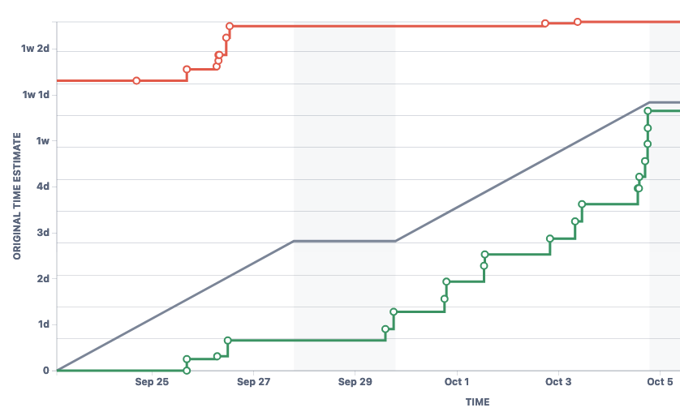

# FitLife: Healthy Life, Happy Life

> **FitLife is a comprehensive iOS app for gym tracking and nutrition management.**

## Table of Contents
- [Description](#description)
- [General Info](#general-info)
- [Technologies Used](#technologies-used)
- [Features](#features)

## Description

### Who We're Working With
Our team consists of:
- **[Jonas Tuttle](mailto:jonastuttle@txstate.edu)**
- **[Thomas Mendoza](mailto:tmendoza@txstate.edu)**
- **[Sam Arshad](mailto:jsb211@txstate.edu)**
- **[Luke Flannigan](mailto:nym15@txstate.edu)**
- **[Gabriel Ciaburri](mailto:aff38@txstate.edu)**

### What We're Creating
We are developing **FitLife: Healthy Life, Happy Life**, an iOS app designed to help users track their gym workouts and nutrition. FitLife aims to be an all-in-one fitness companion that simplifies achieving health and fitness goals by providing tools for logging exercises, tracking nutritional intake, setting goals, and monitoring progress.

### Who We're Doing It For
Our target audience includes fitness enthusiasts, gym-goers, and anyone interested in improving their health and wellness. FitLife is designed to support both beginners starting their fitness journey and experienced athletes aiming to optimize their regimen.

### Why We're Doing This
We believe that maintaining a healthy lifestyle should be accessible and straightforward. By creating FitLife, we hope to empower users to take control of their fitness journeys, make informed decisions, and achieve their personal health goals. Our mission is to have a positive impact on users' lives by promoting wellness and providing a supportive platform for their fitness endeavors.

## General Info

### What's Missing
We would benefit from:
- **User Feedback**: Early adopters willing to test the app and provide valuable feedback.
- **Additional Expertise**: Specialists in AI and machine learning for future feature integrations.
- **Funding**: Financial support to enhance development and expand functionalities.

## Technologies Used
- **[Swift](https://developer.apple.com/swift/)** - Programming language for iOS development.
- **[SwiftUI](https://developer.apple.com/xcode/swiftui/)** - A modern framework for building user interfaces across all Apple platforms.
- **[Xcode](https://developer.apple.com/xcode/)** - An integrated development environment (IDE) for macOS containing a suite of software development tools.
- **[Firebase](https://firebase.google.com/)** - A platform developed by Google for creating mobile and web applications, providing backend services like authentication and data storage.
- **[Firestore](https://firebase.google.com/products/firestore)** - A scalable NoSQL cloud database to store and sync data for client- and server-side development.
- **[Figma](https://www.figma.com/)** - A collaborative interface design tool used for creating UI designs and prototypes.
- **[Jira](https://www.atlassian.com/software/jira)** - A project management tool for tracking tasks, bugs, and sprints.
- **[Bitbucket](https://bitbucket.org/)** - A Git-based source code repository hosting service for collaboration.

## Features

### Initial Features for the First Sprint (MVP)

For our first two-week sprint, we aim to develop a Minimum Viable Product (MVP) that includes the following features:

#### 1. Account Creation and Login

- **Description**: Users can create an account and log in securely to store their data and access it across devices.
- **Who Uses It**: All users of the app.
- **Corresponding User Story**:  
  As a new user, I would like to create an account and log in so that my data is securely stored and accessible across devices.

#### 2. Workout Logging

- **Description**: Enables users to log their workouts by adding exercises with sets, reps, and weights, allowing them to track their fitness progress over time.
- **Who Uses It**: Users who want to track their workout routines and monitor their progress.
- **Corresponding User Story**:  
  As a user, I would like to log my workouts by adding exercises with sets and reps so that I can track my fitness progress over time.

#### 3. Nutrition Logging

- **Description**: Allows users to log their food intake by adding food items with nutritional data, helping them to track daily nutrition and calorie intake.
- **Who Uses It**: Users looking to monitor their nutritional intake and manage their diet.
- **Corresponding User Story**:  
  As a user, I would like to log my food intake by adding food items with nutritional data so that I can track my daily nutrition and calorie intake.

#### 4. View Daily Summaries

- **Description**: Provides users with daily summaries of their workouts and nutrition, including total calories consumed and burned, and visual representations of macro distributions.
- **Who Uses It**: Users who want to easily assess their daily fitness and dietary activities.
- **Corresponding User Story**:  
  As a user, I would like to view summaries of my daily workouts and nutrition so that I can easily assess my daily fitness and dietary activities.

#### 5. Basic Goal Setting

- **Description**: Allows users to set basic fitness goals, such as daily calorie intake and weekly workout frequency, and track their progress towards these goals.
- **Who Uses It**: Users aiming to achieve specific health objectives and stay motivated.
- **Corresponding User Story**:  
  As a user, I would like to set basic fitness goals (e.g., daily calorie intake, workout frequency) so that I have targets to motivate my fitness journey.

 

## Sprint 1

### Burnup Chart

### Contributions
**Thomas**: "Provided users with a UI and functionality in Swift to create and save custom workouts to their account"
- `Jira Task: 1. Design Workout Logging UI` 
    - [CTP-22](https://cs3398-borgs-f24.atlassian.net/browse/CTP-22?atlOrigin=eyJpIjoiMzVhNWE1MWUzNWJhNDBmZWFiMzdlOTVhYTkwMmJmYWIiLCJwIjoiaiJ9), [Bitbucket Link](https://bitbucket.org/cs3398-borgs-f24/fitlife-healthy-life-happy-life/branch/CTP-22-1.-design-workout-logging-ui)
- `Jira Task: 2. Create Exercise and Workout Data Models`
  - [CTP-23](https://cs3398-borgs-f24.atlassian.net/browse/CTP-23?atlOrigin=eyJpIjoiZjA2ZWMwZThiODQ1NDgxM2JmOGVjMGQwYTg2ZGI0MjkiLCJwIjoiaiJ9), [Bitbucket link](https://bitbucket.org/cs3398-borgs-f24/fitlife-healthy-life-happy-life/branch/CTP-23-2.-create-exercise-and-workout-da)
- `Jira Subtask: Create Xcode project in team bitbucket for everyone to edit`
  - [CTP-92](https://cs3398-borgs-f24.atlassian.net/browse/CTP-92?atlOrigin=eyJpIjoiYWYzMzNlYTA0YTNmNDRlYmExYWQ0YjlmZjJiODdjZGQiLCJwIjoiaiJ9), [Bitbucket Link](https://bitbucket.org/cs3398-borgs-f24/%7B87bd3ba6-e4f4-475c-89d4-674a7f216cd5%7D/branch/CTP-92-create-xcode-project-in-team-bitb)
- `Jira Task: 3. Implement Functionality to Add and Save Workouts`
  - [CTP-24](https://cs3398-borgs-f24.atlassian.net/browse/CTP-24?atlOrigin=eyJpIjoiOGRiNDgyMTkwZjBmNDhmZGFiYjRiMDcwZTdiMzJhYWMiLCJwIjoiaiJ9), [Bitbucket Link](https://bitbucket.org/cs3398-borgs-f24/%7B87bd3ba6-e4f4-475c-89d4-674a7f216cd5%7D/branch/feature/CTP-24-3.-implement-functionality-to-add)

**Luke**: "Designed and implemented key user interface components, including the nutrition view, opening screens, dashboard, and profile page, enhancing user navigation and interaction within the app."

- `Jira Task: Design Nutrition Logging UI`
  - [CTP-27](https://cs3398-borgs-f24.atlassian.net/browse/CTP-27), [Bitbucket Link](https://bitbucket.org/cs3398-borgs-f24/fitlife-healthy-life-happy-life/branch/CTP-27-1.-nutrition-ui)
- `Jira Task: Design Opening Screens`
  - [CTP-96](https://cs3398-borgs-f24.atlassian.net/browse/CTP-96), [Bitbucket Link](https://bitbucket.org/cs3398-borgs-f24/fitlife-healthy-life-happy-life/pull-requests/2/overview)
- `Jira Task: Implement Opening Screens`
  - [CTP-98](https://cs3398-borgs-f24.atlassian.net/browse/CTP-98), [Bitbucket Link](https://bitbucket.org/cs3398-borgs-f24/fitlife-healthy-life-happy-life/branch/CTP-98-implement-opening-screens)
- `Jira Task: Design Dashboard UI for Daily Summaries`
  - [CTP-32](https://cs3398-borgs-f24.atlassian.net/browse/CTP-32), [Bitbucket Link](https://bitbucket.org/cs3398-borgs-f24/fitlife-healthy-life-happy-life/branch/CTP-32-1.-design-dashboard-ui)
- `Jira Task: Implement Profile View Screen`
  - [CTP-36](https://cs3398-borgs-f24.atlassian.net/browse/CTP-36), [Bitbucket Link](https://bitbucket.org/cs3398-borgs-f24/fitlife-healthy-life-happy-life/branch/CTP-36-5.-implement-profile-view-screen)
- `Jira Task: Calculate and Display Total Daily Nutrition`
  - [CTP-30](https://cs3398-borgs-f24.atlassian.net/browse/CTP-30), [Bitbucket Link](https://bitbucket.org/cs3398-borgs-f24/fitlife-healthy-life-happy-life/branch/CTP-30-4.-calculate-and-display-nutrition)
  
  **Jonas**: "Implemented Firebase into app, added functionality for user authentication, and designed/set-up app splash view."

  - `Jira Task: 4 - Design App Folder Navigation)`
    - [CTP-40](https://cs3398-borgs-f24.atlassian.net/browse/CTP-40),
    [Bitbucket Link]https://bitbucket.org/cs3398-borgs-f24/fitlife-healthy-life-happy-life/branch/CTP-40-4.-design-app-folder-navigation)
  - `Jira Task: 2 - Set Up Firebase Authentication in Project`
    - [CTP-18](https://cs3398-borgs-f24.atlassian.net/browse/CTP-18),
    [Bitbucket Link](https://bitbucket.org/cs3398-borgs-f24/fitlife-healthy-life-happy-life/branch/CTP-18-2.-set-up-firebase-authentication)
  - `Jira Task: 3 - Implement SplashView Functionality`
    - [CTP-34](https://cs3398-borgs-f24.atlassian.net/browse/CTP-34),
    [Bitbucket Link](https://bitbucket.org/cs3398-borgs-f24/fitlife-healthy-life-happy-life/branch/CTP-34-3.-implement-splashview-functiona)
  - `Jira Task: 2 - Design SplashView`
    - [CTP-33](https://cs3398-borgs-f24.atlassian.net/browse/CTP-33),
    [Bitbucket Link](https://bitbucket.org/cs3398-borgs-f24/fitlife-healthy-life-happy-life/branch/CTP-33-2.-design-splashview)
  - `Jira Task: 1 - Implement Sign-in and Login functionality`
    - [CTP-17](https://cs3398-borgs-f24.atlassian.net/browse/CTP-17),
    [Bitbucket Link](https://bitbucket.org/cs3398-borgs-f24/fitlife-healthy-life-happy-life/branch/feature/CTP-17-1.-Authentication)
  
  **Gabriel**: "Implemented goal setting data models to keep track of all user data for progress over time, as well as the views associated with goals."

  - `Jira Task: 1. Design Goal Setting UI`
    - [CTP-37](https://cs3398-borgs-f24.atlassian.net/browse/CTP-37)
  - `Jira Task: 2. Implement Functionality to set User Basic Info`
    - [CTP-38](https://cs3398-borgs-f24.atlassian.net/browse/CTP-38)
  - `Jira Task: 3. Implement Progress Tracking on Dashboard`
      - [CTP-39](https://cs3398-borgs-f24.atlassian.net/browse/CTP-39)

  **Sam**: To sum up my contributions: Refactored, modified and added *Backend* + *Frontend* code for the nutrition segment.
  - [SCRUM 108 - I worked on implementing a "Food search" feature for](https://bitbucket.org/cs3398-borgs-f24/fitlife-healthy-life-happy-life/src/SCRUM-108-Food_Recipe_Search/)
    - **Note**: Due to Jira's synchronization issues with Premium/Standard Free version the actual branch name is: [SCRUM-108-Food_Recipe_Search](https://bitbucket.org/{}/{87bd3ba6-e4f4-475c-89d4-674a7f216cd5}/branch/SCRUM-108-Food_Recipe_Search "SCRUM-108-Food_Recipe_Search")

  - [SCRUM 101 - Implemented Functionality to Add and Save Food Entries](https://bitbucket.org/cs3398-borgs-f24/fitlife-healthy-life-happy-life/src/SCRUM-101-Functionality-to-Add-and-Save-Food-Entries/)

  - [SCRUM 103 - Implementing Functionality to Save and Retrieve Macro Goals](https://bitbucket.org/cs3398-borgs-f24/fitlife-healthy-life-happy-life/src/SCRUM-103-Implement-Functionality-to-Save-and-Retrieve-Macro-Goals/)
     - Wrote the Code for this and have commits on my Repo (weirdly they don't show up on JIRA/Bitbucket)
     - I have the actual code, just need Data Persistence for this to be complete. 

  - [SCRUM 104 - Update Nutrition Tracker to Display Goals vs. Actual Intake](https://bitbucket.org/cs3398-borgs-f24/fitlife-healthy-life-happy-life/src/SCRUM-104-Update-Nutrition-Tracker-to-Display-Goals-vs.-Actual-Intake/)
     - Same as previous one. 

### Next Steps
**Thomas**: 
- Implement workout API to have prexisting exercises to simplify input process
  - [Workout API](https://www.api-ninjas.com/api/exercises)
- Design reports UI
- Use user workout data to generate customized reports
- Implement daily AI-powered workout suggestions from user data
  - pull suggestions from goals and existing workouts

**Luke**:
- Integrate the Nutrition View UI with backend services to enable real-time tracking and input of user data.
- Implement functionality in the Profile section to allow users to update and customize their personal profiles.
- Connect the Progress section to backend services to display real-time user data and achievements.

**Jonas**:
- Design and implement general app/account settings, such as username/password changes, log out, account deletion, etc.
- Work with real-time analytics to track user app usage.
- Set up basic notification functionality; test various effective ways to work notifications into the app via location, daily progress, etc.
- Study and implement ways to test new features on the app.

**Gabriel**:
- Integrate goal tracking with workouts and calorie counter.
- Implement day-to-day, week-to-week, etc. goals on dashboard.
- Integrate SwiftData with Firebase authentication.

**Sam**: 
With Data Persistence I will be
- Completing the Functionalities of Adding and Saving Food Entries. 
- Completing the Functionalities of Saving and Retrieving Macro Goals. 
- Updating the Nutrition Tracker to Display Goals vs. Actual Intake
- Working on the UI to have a consistent look/views in the App.
- Working on Cleaning up the UI and helping my team members where necessary. 

---
